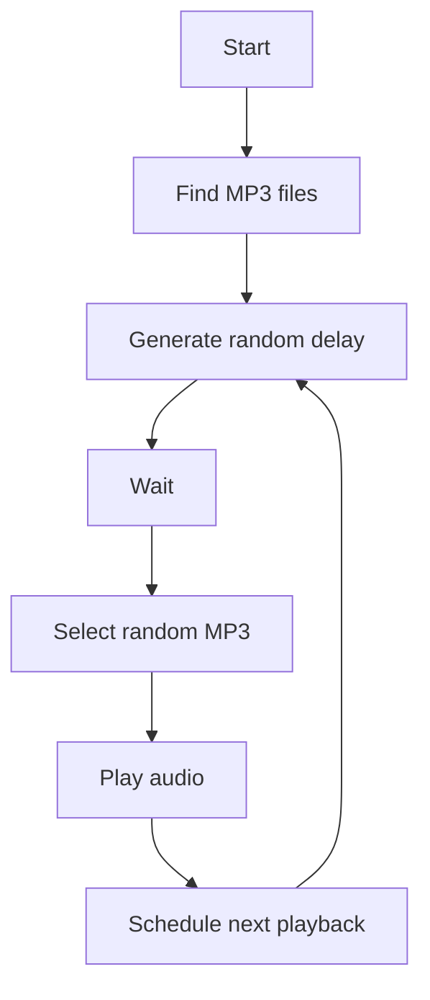

<div align="center">

# Java Random Audio Player

**A lightweight Java app that plays random MP3 files at random time intervals.**


</div>

---

## About

This project was built to practice Java file handling, scheduled task execution, Maven dependency management, MP3 playback, and Windows application packaging.

## Features

- Randomly selects an MP3 file from the `sounds` directory
- Plays audio after a randomly generated delay
- Supports multiple MP3 files
- Runs as a background Windows application
- Can be packaged as a standalone Windows application
- Uses Java's `ScheduledExecutorService` for scheduling

## Tech Stack

| Area | Technology |
|------|------------|
| Language | Java 17 |
| Build tool | Maven |
| Audio playback | JLayer |
| Scheduling | Java Concurrency API (`ScheduledExecutorService`) |
| Packaging | `jpackage` |
| Installer | Inno Setup |
| Version control | Git & GitHub |

## 📂 Project Structure

```text
java-random-audio-player/
├── src/
│   └── main/
│       └── java/
│           └── MJPrank.java
├── sounds/            # your own MP3 files (not included in the repo)
├── pom.xml
├── .gitignore
└── README.md
```

## Getting Started

### Prerequisites

- Java 17 or later
- Maven
- Git

Verify your installation:

```bash
java -version
mvn -version
git --version
```

### 1. Clone the repository

```bash
git clone https://github.com/Aashish2409/java-random-audio-player.git
cd java-random-audio-player
```

### 2. Add audio files

Create a `sounds` directory in the project root and add your own MP3 files:

```text
sounds/
├── sound1.mp3
├── sound2.mp3
└── sound3.mp3
```

> 📝 Audio files are not included in the repository.

### 3. Build the project

```bash
mvn clean package
```

The compiled JAR is generated in the `target` directory.

### 4. Run the application

```bash
java -cp target/mj-prank-1.0.jar MJPrank
```

## ⚙️ Configuration

The minimum and maximum delay between playbacks can be changed in `MJPrank.java`:

```java
private static final int MIN_DELAY_SECONDS = 5;
private static final int MAX_DELAY_SECONDS = 15;
```

For example, to play sounds at random intervals between 10 and 30 seconds:

```java
private static final int MIN_DELAY_SECONDS = 10;
private static final int MAX_DELAY_SECONDS = 30;
```

## 🧠 How It Works



The app uses `ScheduledExecutorService` to schedule the next playback without continuously polling or blocking the main scheduling logic.

## 🪟 Windows Packaging

Package the app as a standalone Windows application with Java's `jpackage`:

```bash
jpackage --input app --name MJPrank --main-jar mj-prank-1.0.jar --type app-image
```

The result includes the required Java runtime, so no separate Java installation is needed. A Windows installer can also be created with **Inno Setup**.

## What I Learned

- Java file and directory handling
- Exception handling
- Random number generation
- Java concurrency and scheduled tasks
- Maven dependency management
- JAR packaging
- Using third-party Java libraries
- Packaging with `jpackage`
- Windows application packaging
- Building installers with Inno Setup
- Git and GitHub


## ⚠️ Disclaimer

This project is for personal experimentation and educational purposes. Only use the application and audio files on systems where you have permission to do so.

## 📄 License

This project is provided for personal and educational use.

---

<div align="center">

Built by [Aashish](https://github.com/Aashish2409)

</div>
